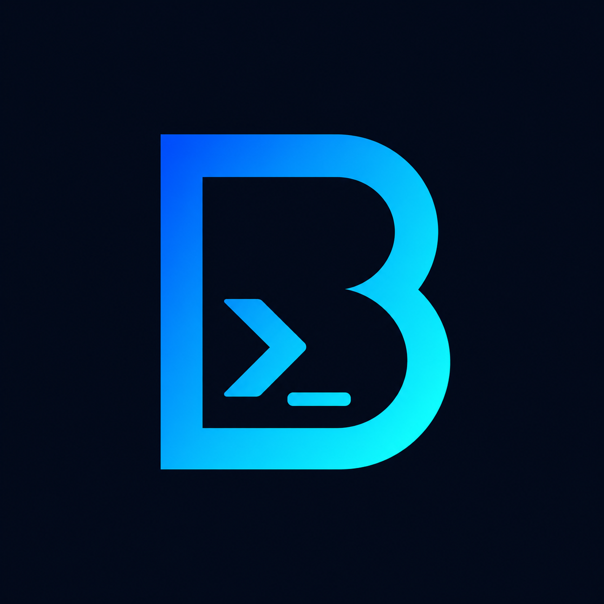

<p align="center">
  
</p>

<h1 align="center">BoudyOS</h1>

<p align="center">
  A security-focused personal Telegram workspace built with Telethon.
</p>

## About

BoudyOS is a personalized public fork of
[TeamUltroid/Ultroid](https://github.com/TeamUltroid/Ultroid). It keeps Ultroid's
plugin ecosystem, deployment model, session format, database contracts, and
upstream-compatible internals while presenting a focused BoudyOS experience.

The `pyUltroid` package, `UltroidClient`, commands, callback data, environment
keys, and database identifiers intentionally retain their upstream names for
compatibility.

## Features

- BoudyOS 2.2 safe parsing, bounded processes, and release-aware status
- Dashboard-based help for plugins, add-ons, voice chat, settings, and updates
- Telegram assistant and private log-group integration
- Verified trusted add-on workflow; untrusted install/load paths are opt-in
- Optional plugin/dependency profiles and voice-chat components
- Redis, MongoDB, PostgreSQL, and local database support inherited from Ultroid
- Pinned tag+commit deployment, authenticated encrypted backups, and health checks
- Python 3.10 and 3.13, including native Linux ARM64 deployments

## Deploy

### Requirements

- Python 3.10 or newer
- Telegram `API_ID`, `API_HASH`, and a user `SESSION`
- One supported database configuration:
  - `REDIS_URI` and `REDIS_PASSWORD`
  - `MONGO_URI`
  - `DATABASE_URL`

Never publish your `.env`, session string, bot token, database credentials, or
generated session files.

### Local

```bash
git clone https://github.com/boudywho/BoudyOS.git
cd BoudyOS
python3 -m venv venv
. venv/bin/activate
constraint=py310.txt  # use py313.txt on CPython 3.13+
python -m pip install -r requirements/media.txt -c "constraints/$constraint"
python -m pip check
cp .env.sample .env
```

Fill in `.env`, generate a session with `bash sessiongen` if needed, then run:

```bash
bash startup
```

On Windows, use:

```powershell
python -m pyUltroid
```

### Docker Compose

Create `.env`, then run:

```bash
docker compose up --build -d
```

For native ARM64, use the same venv flow and install distribution packages for
FFmpeg and MediaInfo. Optional binary wheels vary by platform; select only the
matching files under `requirements/`.

## Updates and upstream compatibility

Telegram compares the active release metadata with the root-configured release
tag and full commit. It can only invoke the short, allowlisted `request` action;
systemd performs the verified deployment. The bot never pulls, resets, or
installs dependencies. TeamUltroid is provenance and reviewed sync only.

Docker builds do not fabricate a checkout of remote `main`. Release/CI builders
pass `BOUDYOS_SOURCE_COMMIT`, `BOUDYOS_SOURCE_TAG`, and
`BOUDYOS_SOURCE_DIRTY=0`; default local builds record an unverified/dirty
identity and disable Git-based update assumptions.

- BoudyOS source and support:
  [github.com/boudywho/BoudyOS](https://github.com/boudywho/BoudyOS)
- Upstream project:
  [TeamUltroid/Ultroid](https://github.com/TeamUltroid/Ultroid)
- Upstream add-ons:
  [TeamUltroid/UltroidAddons](https://github.com/TeamUltroid/UltroidAddons)

Read [the 2.2 migration guide](./MIGRATION.md), [security policy](./SECURITY.md),
and [changelog](./CHANGELOG.md) before upgrading. Dangerous owner Python
execution and untrusted raw add-ons are disabled by default.

## License and credits

BoudyOS remains licensed under the
[GNU Affero General Public License v3 or later](./LICENSE). Existing copyright
and license headers are preserved.

The core architecture and substantial implementation come from
[TeamUltroid](https://github.com/TeamUltroid/Ultroid) and its contributors.
BoudyOS also inherits work built on
[Telethon](https://github.com/LonamiWebs/Telethon) and
[PyTgCalls](https://github.com/pytgcalls/pytgcalls). See the repository history
for the complete contributor record.
